<div align="center">

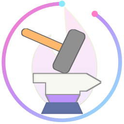

# Hefesto - DualSense4Unix

O DualSense completo no Linux: gatilhos adaptativos, luz, vibração, giroscópio, áudio e até quatro jogadores.

[](LICENSE)
[](https://www.python.org/)
[](CHANGELOG.md)
[](https://github.com/Hefesto-Team/hefesto-dualsense4unix/actions/workflows/ci.yml)
[](https://www.patreon.com/Hefesto_Team)

</div>

Versão: 0.9.5 (alfa)

## O que é

O Hefesto é um serviço para Linux que faz o controle DualSense, do PS5, funcionar por inteiro no PC. Os gatilhos resistem, a barra de luz muda de cor, a vibração tem a força que você escolher, e o giroscópio, o touchpad, o microfone e o alto-falante chegam ao jogo. Cada DualSense ligado vira um jogador, por cabo ou por Bluetooth, até quatro.

Você configura tudo por uma janela com dez abas. Também há um ícone na bandeja, uma interface de terminal e uma linha de comando.

## Para quem é

Para quem joga no Linux com um DualSense, e em especial para quem precisa adaptar o controle ao próprio corpo. Com o Hefesto dá para:

- trocar um botão por outro, inclusive em jogos que não deixam remapear;
- mirar movendo o controle: a Mira Virtual leva o giroscópio ao analógico direito;
- usar o controle como mouse e teclado, com teclado na tela;
- diminuir, aumentar ou desligar a vibração de cada lado, em cada controle;
- deixar os gatilhos macios, duros ou sem resistência;
- guardar esses ajustes num perfil por jogo, que entra sozinho quando o jogo abre.

## O que ele faz

- Gatilhos adaptativos com os efeitos do DualSense (rígido, pulso, arco, galope, metralhadora e outros), ajustados por controle.
- Cor da barra de luz e luz de jogador em cada controle.
- Vibração com força por controle e por motor.
- Giroscópio, acelerômetro e touchpad entregues ao jogo.
- Microfone e alto-falante de cada controle como dispositivos de áudio do sistema.
- Co-op local, com um controle virtual por jogador.
- O jogo pode enxergar um DualSense, um Xbox 360 ou um Nintendo Pro, ou falar direto com o controle físico.
- Perfis por jogo para Steam, Heroic, Lutris, RetroArch e outros lançadores.
- Compatibilidade parcial com mods do DualSenseX, por UDP em `127.0.0.1:6969` ([udp-schema.md](docs/protocol/udp-schema.md)).
- Automação: um socket JSON-RPC local ([ipc-unix-socket.md](docs/protocol/ipc-unix-socket.md)) e plugins em Python, que se ligam com `hefesto-dualsense4unix plugin ligar` ([exemplos](examples/)).

Controles Nintendo Pro e 8BitDo também são reconhecidos, mas chegam ao jogo como o controle que já são.

## A janela

| | |
|---|---|
| Jogar | Controles |
| 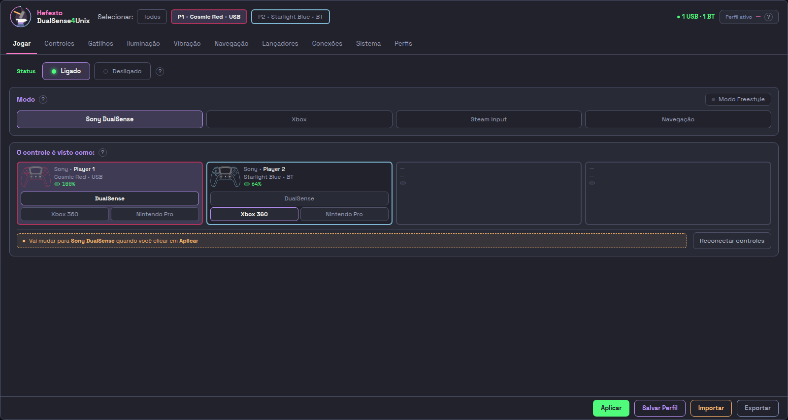 | 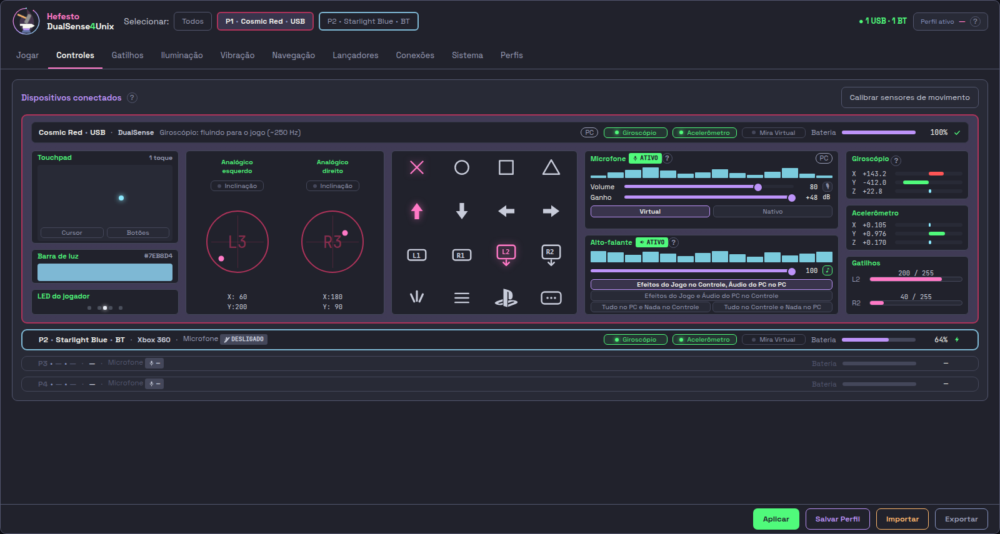 |
| Gatilhos | Iluminação |
| 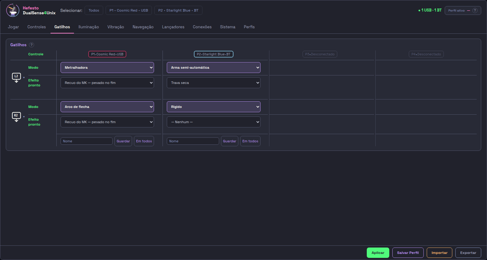 | 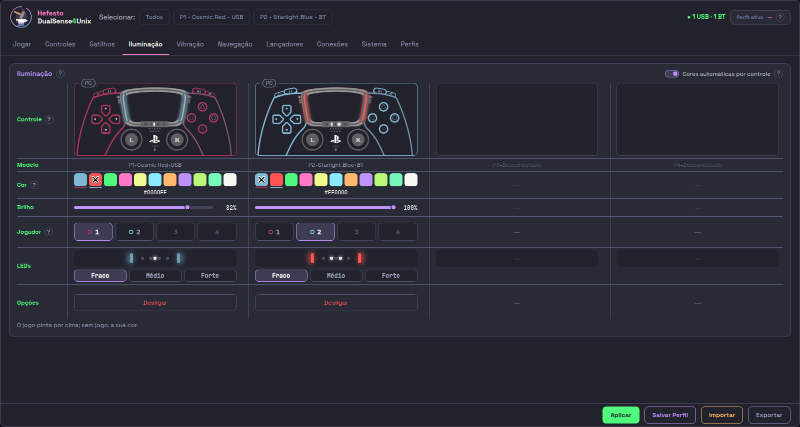 |
| Vibração | Navegação |
| 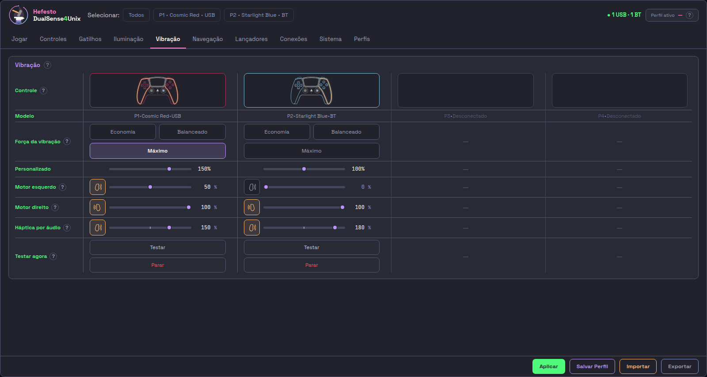 | 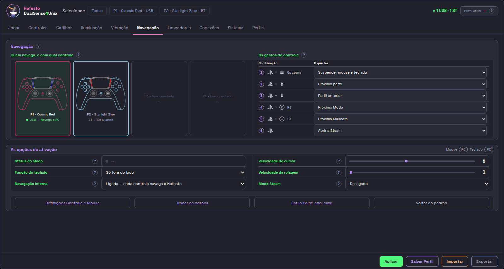 |
| Lançadores | Conexões |
| 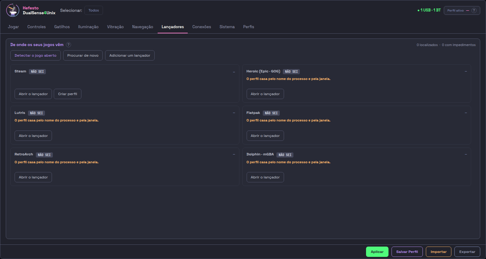 | 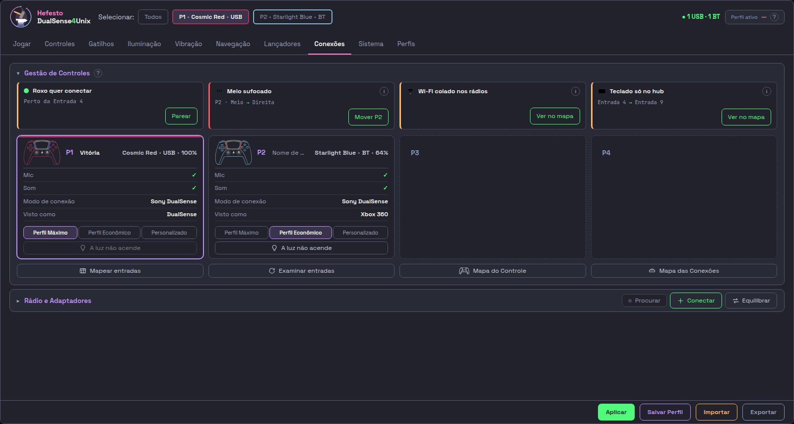 |
| Sistema | Perfis |
| 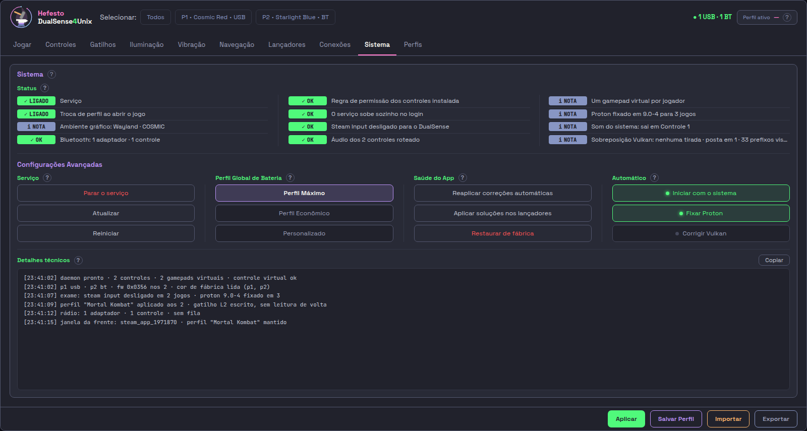 | 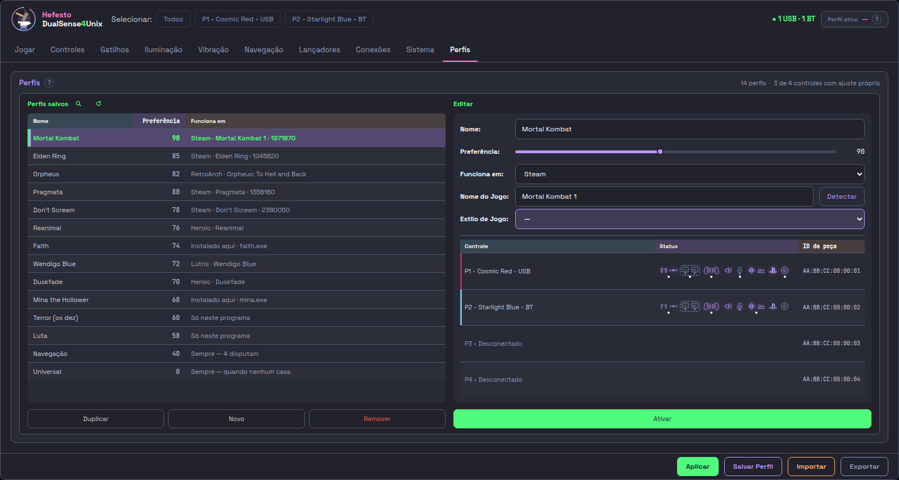 |

O que cada aba faz: [docs/usage/AS-DEZ-ABAS-o-que-cada-uma-faz.md](docs/usage/AS-DEZ-ABAS-o-que-cada-uma-faz.md).

## Instalar

Você precisa de Linux com systemd (incluindo o `systemd-logind`), Python 3.10 ou mais novo e um DualSense ou DualSense Edge.

```bash
git clone https://github.com/Hefesto-Team/hefesto-dualsense4unix.git
cd hefesto-dualsense4unix
./install.sh
```

O instalador instala as dependências pelo gerenciador de pacotes da distribuição (apt, dnf ou pacman), pede a senha de administrador uma vez e pergunta antes dos passos opcionais. Enter aceita a resposta padrão. Sem terminal interativo, use `./install.sh --yes`. Não rode com `sudo` na frente.

Com o Secure Boot ligado, os módulos de kernel só carregam depois de você registrar a chave do DKMS: `sudo mokutil --import /var/lib/dkms/mok.pub` e reiniciar. Sem isso, um controle Nintendo pode sumir depois de reiniciar.

Depois, abra o Hefesto pelo menu de aplicativos ou com `hefesto-dualsense4unix-gui`. O serviço passa a subir sozinho no login.

A primeira configuração é mais simples com o controle no cabo USB. Para parear por Bluetooth, ligue o Procurar na aba Conexões, segure PS + Create no controle e clique em Parear na linha dele.

### O que o instalador muda no sistema

O Hefesto mexe em partes do sistema que um programa comum não toca. Com as opções padrão, ele instala:

- regras udev para os controles e para os dispositivos virtuais;
- serviços do systemd, do usuário e do sistema;
- três módulos de kernel corrigidos, compilados via DKMS (`hid-playstation`, `hid-nintendo` e `rtw88-usb`);
- parâmetros de boot para o USB do controle;
- ajustes no Bluetooth e, se você confirmar, uma versão corrigida do BlueZ;
- ajustes na Steam: opções de inicialização dos jogos e uma versão fixa do Proton.

Cada item tem uma opção para pular. Para ver o plano sem mudar nada, rode `./install.sh --dry-run`. A lista completa está em [instalacao.md](docs/usage/instalacao.md).

Há também pacotes `.deb`, Flatpak, AppImage, Arch, Fedora e Nix, mas o caminho testado é o `./install.sh`.

### Desinstalar

```bash
./uninstall.sh
```

Desfaz o que o instalador fez. Seus perfis ficam guardados; com `--purge-config` eles também saem, depois de uma cópia de segurança.

## Usar

A aba Jogar decide como o controle chega ao jogo:

- Status: ligado, o Hefesto cuida da luz, da vibração, dos gatilhos e do número de cada jogador; desligado, o jogo fala direto com o controle.
- Modo: Sony DualSense, Xbox, Steam Input, Navegação ou Nativo. O Hefesto tenta na ordem da lista e fica no primeiro que funcionar. Navegação transforma o controle em mouse e teclado. Nativo deixa o jogo falar com o controle sem o Hefesto no meio.
- Máscara: DualSense, Xbox 360 ou Nintendo Pro. Ela muda o desenho dos botões que o jogo mostra; o controle na sua mão continua o mesmo.

Com o Modo Freestyle ligado, o perfil ativo continua valendo quando você abre outro jogo; desligado, o Hefesto volta a escolher o perfil de cada jogo. As outras abas ajustam gatilhos, luz, vibração e sensores, e o botão Salvar Perfil guarda tudo no perfil ativo. Para escolher modo e máscara em cada jogo, veja [jogos-e-mascaras.md](docs/usage/jogos-e-mascaras.md).

### Atalhos no controle

| Gesto | O que faz |
|---|---|
| PS + direcional para cima / para baixo | próximo perfil / perfil anterior |
| PS + R3 | próximo modo |
| PS + L3 | próxima máscara |
| PS + Options | pausa o mouse e o teclado do controle |
| PS, sozinho | abre a Steam (dá para trocar) |
| L3 / R3, no modo Navegação | abre / fecha o teclado na tela |
| Botão do microfone | liga e desliga o microfone daquele controle |

Mais em [hotkeys.md](docs/usage/hotkeys.md).

### Linha de comando

```bash
hefesto-dualsense4unix status                    # serviço e controles
hefesto-dualsense4unix doctor                    # diagnóstico; --fix corrige o que puder
hefesto-dualsense4unix profile list              # perfis salvos
hefesto-dualsense4unix profile activate <nome>
hefesto-dualsense4unix led --color "#FF0080"     # cor da barra de luz
hefesto-dualsense4unix gamepad on --flavor xbox  # o jogo vê um Xbox 360
hefesto-dualsense4unix native on                 # o jogo fala direto com o controle
hefesto-dualsense4unix tui                       # interface de terminal
```

O serviço roda na sua sessão:

```bash
systemctl --user status hefesto-dualsense4unix.service
journalctl --user -u hefesto-dualsense4unix -f
```

Referência completa em [cli.md](docs/usage/cli.md).

## Limitações

- É uma versão alfa. Os testes com controle de verdade são feitos em Pop!_OS 24.04 com COSMIC. O Ubuntu passa pelo CI, sem controle. Fedora, Arch, Debian e Mint têm pacote, mas ainda não foram testados com um controle ligado. As versões conferidas estão em [versoes-validadas.md](docs/usage/versoes-validadas.md).
- Distribuições sem `systemd-logind` (Alpine com OpenRC, Void, Artix) não são suportadas.
- A troca automática de perfil reconhece jogos que rodam em X11 ou XWayland, o que inclui a Steam e o Proton. Janelas Wayland nativas ainda não são reconhecidas.
- Pelo Bluetooth, o microfone de cada controle já vem ligado, e enquanto algum programa o escuta ele divide o rádio com os comandos do controle. No cabo não há esse custo.
- Os pareamentos Bluetooth podem sumir por dois motivos: um defeito conhecido do BlueZ, que derruba o `bluetoothd`, ou o controle pareado por Bluetooth e ligado no cabo ao mesmo tempo. O instalador oferece um BlueZ corrigido, e o Hefesto guarda cópia dos pareamentos. Detalhes em [bluetooth.md](docs/usage/bluetooth.md).
- O 8BitDo por Bluetooth funciona no modo DirectInput/PS4, e não no modo Switch. Detalhes em [troubleshooting-8bitdo.md](docs/usage/troubleshooting-8bitdo.md).

Quando algo não funcionar, comece por `hefesto-dualsense4unix doctor` e por [troubleshooting.md](docs/usage/troubleshooting.md).

## Contribuir

Issues e pull requests são bem-vindos. Para uma mudança grande, abra uma issue antes, para combinarmos o caminho. O guia está em [CONTRIBUTING.md](.github/CONTRIBUTING.md).

Relatos de outras distribuições ajudam muito: abra uma issue com a saída de `hefesto-dualsense4unix doctor`, o nome da distribuição e a versão do kernel.

O projeto é escrito em português do Brasil: código, documentação e commits.

## Apoiar

Se o Hefesto te ajuda, considere apoiar pelo [Patreon](https://www.patreon.com/Hefesto_Team).

## Licença

MIT, exceto os módulos de kernel em `assets/dkms/`, que derivam do Linux e mantêm a licença do próprio cabeçalho: GPL-2.0-or-later para `hid-nintendo`, `hid-playstation` e `uhid`, e GPL-2.0 OR BSD-3-Clause para `rtw88-usb`. Eles são distribuídos como fonte e compilados na sua máquina pelo DKMS. Detalhes em [LICENSE](LICENSE) e [NOTICE](NOTICE).
